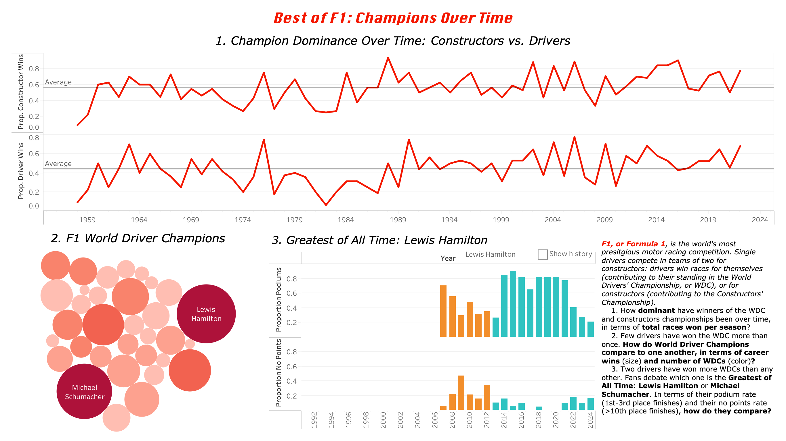

# MACS 40700 Assignment 4: F1 Champions

<iframe src="https://public.tableau.com/views/F1Champions_17398427006190/F1Champions?:language=en-US&:sid=&:redirect=auth&:display_count=n&:origin=viz_share_link?:showVizHome=no&:embed=true" width="980px" height="900px"></iframe>

| Tableau Dashboard |
|--------|
|  |
| *Static image of the F1 Champions Tableau Dashboard. Click the link below for the full, interactive experience!* |

[Link to Tableau Dashboard](https://public.tableau.com/app/profile/reilly.amera/viz/F1Champions_17398427006190/F1Champions)

### Repo Guide
1. *Data folder*: Contains all original data sources and new data sets used 
2. *Images folder*: Contains static images of final Tableau plots and dashboard (as pngs and as a pdf)
3. Data Cleaning.Rmd: All scripts used to transform data sources

## The Story
***Guiding Question:*** *How has the dominance of Formula 1 champions changed over time?*

Formula 1, or F1, is the world's most prestigious motor racing competition. Single drivers compete for constructor teams (two drivers per team). Each season culminates in two championships: the FIA Formula One World Championship for Drivers (the World Drivers' Championship, or WDC) and the Constructors' Championship. To win, drivers must accumulate points, which are awarded based on their final position at the end of each race: first place finishers are awarded the most points, second place finishers are awarded less, and so on. Constructor points are then awarded from both drivers' positions. Whichever driver and team wins the most points by the end of the season is that year's reigning champion. 

The sport has changed quite a bit since 1950, the first year these championships were held. Constructors have created faster, safer cars, and with each generation comes new, hungry drivers aiming to leave their mark on the sport. However, only one driver each season can differentiate himself as the World Driver Champion, and each Champion must fight to keep his title; winning once does not necessarily mean total career dominance. As such, considering the evolution of F1 champions, *to what extent have World Driver Champions' achieved dominance throughout their careers (if at all), and how has this looked throughout the history of the sport?*

To explore this question, we can first look at the proportion of wins (first place finishes) for each World Driver Champion during the season in which they won the championship (Graph 1). Though championships are based on total points, dominance may be assessed using first place finishes as a proxy: the point system has changed over the years, and a greater proportion of first place finishes shows that a driver was less contested throughout his season. Including constructor wins alongside driver wins allows us to see the extent to which a driver's own teammate might have affected his dominance. If a World Driver Champion's teammate, who drives the same car, gives him a run for his money, we might see a higher constructor win rate than driver win rate, showing that this champion was perhaps less dominant.

Another way of thinking about World Driver Champion dominance over time is in exploring how many championships each champion won (Graph 2). Where Graph 1 depicts change over time, Graph 2 allows viewers to see which drivers have had particularly dominant careers, and various metrics in which they displayed such dominance. Though both point systems and races per season have changed over time, this graph allows viewers to gain a more individualized understanding of each driver's career. Further, it becomes clear from Graph 2 that two drivers have had especially dominant careers in terms of total championships won, leading directly into the next plot. 

One final way of thinking about World Driver Champion dominance is in terms of drivers considered to be the "Greatest of All Time," or the "G.O.A.T.s" (Graph 3). Only two drivers in F1 history have won the WDC 7 times apiece—Lewis Hamilton and Michael Schumacher—and fans debate which is the true G.O.A.T. This plot allows viewers to compare Hamilton And Schuamcher's careers directly, in terms of proportions of podiums (1st-3rd place finishes) won throughout their careers and proportions of races where no points were won (>10th place finishes). As podiums allow drivers to attain the greatest number of points, displaying the proportion of podiums upon which Hamilton and Schumacher stood allows viewers to see the extent to which they were able to dominate each season in terms of points. Showing the proportion of races without points, by contrast, allows viewers to see when each driver has been less dominant, and to see how their careers have evolved. 

Thus, each plot displays a different aspect of Formula 1 dominance, and allows viewers to delve more deeply into the specifics with each step.

## Design Choices
I selected a line graph to display champion dominance over time (Graph 1) because this was the clearest way of visualizing change over time. I chose to display the proportion of wins instead of total number of wins because the number of races per season have changed. As such, this was the clearest and most truthful way of displaying dominance of champions over time. I also chose to include an average line to show if/when drivers, constructors, or eras throughout history displayed particularly great dominance (or lack thereof). Interactivity allows viewers to learn about the drivers and constructors behind each peak and valley: while the line helpfully displays change over time, the interactivity allows viewers to gain a more granular understanding of each year and each win. 

I selected a bubble plot to display F1 World Driver Champions by name (Graph 2). Where Graph 1 displays an overall view of change over time, Graph 2 allows viewers to zoom into particular champions and aspects of their careers. I chose to use a bubble plot for visual interest. I chose to use a color gradient to display total number of World Driver Championship wins, and size to display total number of race wins. Though the number of races each season has changed over the course of F1 history, displaying total wins by driver shows dominance in another way: pure racing stamina. Due to sizing constraints within the dashboard, not all names can be shown at once. As such, the interactivity allows viewers to explore each driver in more depth, despite their names not initially appearing, allowing me to convey a greater amount of detail in less space. 

Lastly, I selected bar plots to display the G.O.A.T.s (Graph 3). In Graph 2, the biggest and darkest bubbles are those of Lewis Hamilton and Michael Schumacher. Graph 3 is thus a continuation of Graph 2, allowing viewers to delve even deeper into the most dominant drivers in F1 history. I chose to use bar graphs as opposed to line graphs so that I could display another, categorical aspect of Hamilton and Schumacher's careers via color: the constructors they worked with. Interactivity is especially important to this visualization. Hovering over each bar allows viewers to see that year's constructor, as well as whether or not either Schumacher or Hamilton won the WDC that year. Where just looking at the bar plots allows viewers to see how proportions of wins versus no points races varies over time, the interactivity allows me to present far more information without cluttering the visual field. Further, the ability to flip between Hamilton and Schumacher's careers allows viewers to highlight each driver's career as well as compare them. 

In terms of overall layout, I chose to present Graph 1 at the top, taking up most of the visual field, to show how dominance in F1 champions writ large has changed over time. As the eyes move across the visual field from left to right, once one has moved on from Graph 1, Graph 2 is the next place that a viewer will likely look. As such, Graph 2 zooms in from Graph 1, providing more detail on individual drivers. Lastly, Graph 3 zooms in even further, responding to intrigue created by the large bubbles in Graph 2. The explanation appears last, in the bottom right corner, so as to be unobtrusive while still providing information. As such, this dashboard presents a step-by-step narrative of F1 dominance, from overall trends to notable individuals. 